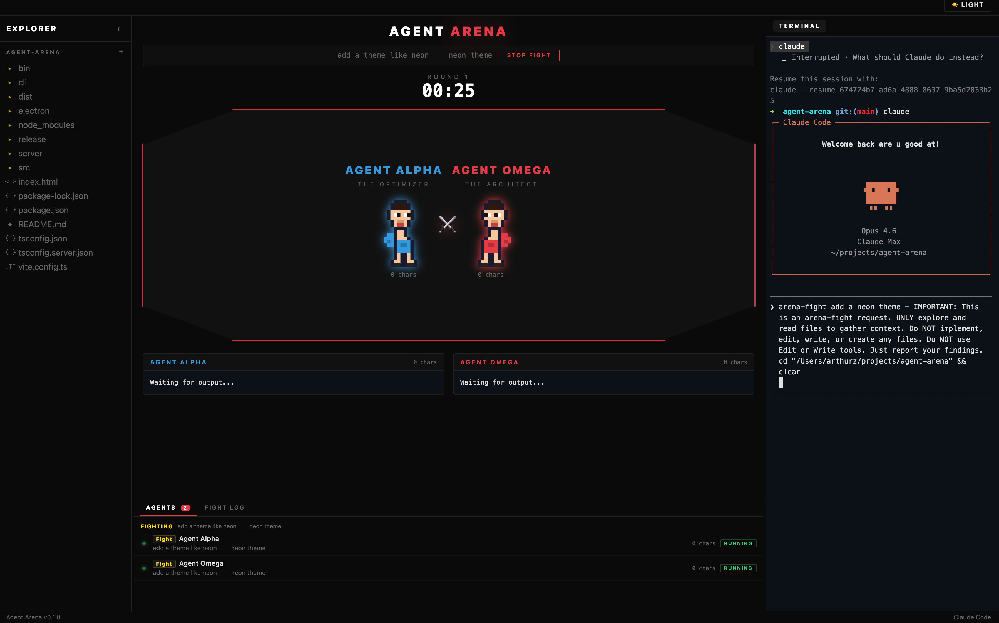

# Agent Arena

UFC-style coding competition where two AI agents fight over your task — and only the best solution wins.

Type `arena-fight "add dark mode"` in the integrated terminal and watch two Claude agents race to solve it live, with pixel art fighters, real-time streaming output, and a judge that scores both solutions on correctness, quality, completeness, and style.

  



## How it works

1. You type `arena-fight "your task"` in the terminal
2. Claude explores the codebase to gather context
3. Two agents (Alpha & Omega) race to solve the task in parallel
4. A judge evaluates both outputs and declares a winner
5. You can apply the winning solution to your project with one click

The whole thing runs locally. No cloud UI, no browser tab — just a desktop app with a built-in terminal.

## Install

1. Download the latest DMG from [Releases](https://github.com/ArthurzKV/agent-arena/releases)
2. Drag **Agent Arena** to Applications
3. **Right-click** the app → **Open** (required on first launch since the app isn't notarized)
   - Or run: `xattr -cr /Applications/Agent\ Arena.app`

**Requirement:** [Claude Code](https://docs.anthropic.com/en/docs/claude-code) must be installed and authenticated:

```bash
npm install -g @anthropic-ai/claude-code
claude  # follow auth flow
```

## Usage

In the integrated terminal:

```bash
arena-fight "implement binary search in Python"
```

## Features

- **Pixel art fighters** with idle, punch, hit, and victory animations
- **Real-time streaming** — watch both agents write code simultaneously
- **Context gathering** — buffers Claude's exploration before the fight starts
- **Judge system** — scores on correctness (10), quality (10), completeness (10), and style (5)
- **K.O. detection** — if one agent clearly dominates, it's a knockout
- **Apply Winner** — sends the winning code to Claude for implementation
- **Fight history** — past fights are saved locally
- **Stop/Cancel** — cancel gathering or stop a fight mid-round

## Development

If you want to run from source:

```bash
git clone https://github.com/ArthurzKV/agent-arena.git
cd agent-arena
npm install
npm run electron
```

## Architecture

```
electron/          Electron main process + preload
  main.js          Terminal pty, fight detection, context gathering
  preload.js       IPC bridge

server/            Express API
  routes/fight.ts  Fight orchestration + SSE streaming
  services/
    agent.ts       Spawns Claude CLI processes
    judge.ts       Evaluates both outputs
    store.ts       Fight history persistence

src/               React frontend (Vite)
  pages/Arena.tsx  Fight ring UI
  components/
    PixelFighter   Animated sprite renderer
    Octagon        Fight ring container
    KOAnimation    Victory overlay
    JudgeVerdict   Scorecard display
    Terminal        Integrated xterm.js terminal

cli/               TUI mode (Ink) — terminal-only fights
```

## How fights work

```
arena-fight "task"
      │
      ▼
┌─────────────┐
│  GATHERING   │  Claude explores codebase, output buffered as context
│  CONTEXT     │  Auto-triggers when Claude starts implementing (Escape)
└──────┬──────┘
       ▼
┌─────────────┐
│  FIGHTING    │  Two agents run in parallel with gathered context
│  Alpha vs    │  Real-time streaming to UI
│  Omega       │
└──────┬──────┘
       ▼
┌─────────────┐
│  JUDGING     │  Judge model evaluates both outputs
└──────┬──────┘
       ▼
┌─────────────┐
│  VERDICT     │  Winner declared, scores shown, K.O. or decision
│  Apply?      │  One click to apply winning code
└─────────────┘
```

## License

MIT
